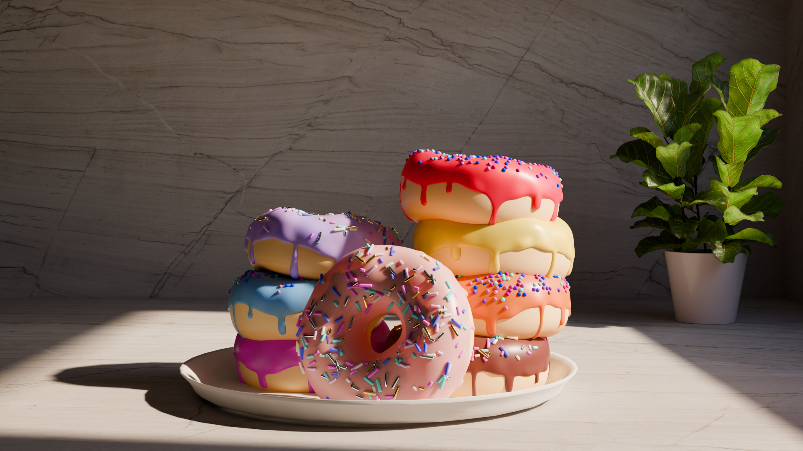

# Blender Donut

My first Blender project: a simple 3D donut scene.

## Software

- Blender 4.5

## Description

A donut scene created while learning Blender.
I practiced modeling, materials, lighting and rendering.

## Credits

Created while learning Blender using the Blender Guru donut tutorial.

Some background materials and flower assets were used from free resources.

## Additional changes

- Custom color palette
- Multiple donuts in the scene
- Custom plate model

## Preview

